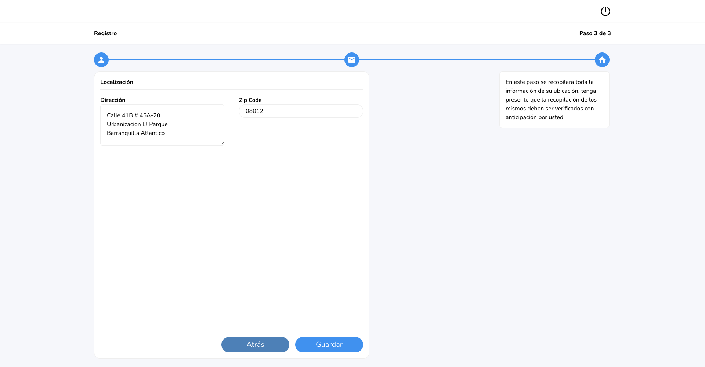

# Gestión de Usuarios con Firebase

Bienvenido a user form firebase, una aplicación web para la gestión de usuarios en tiempo real. En esta documentación, encontrará información sobre las tecnologías utilizadas en el proyecto, cómo funciona la aplicación y cómo instalarla.

## Objetivos del proyecto

El objetivo principal de este proyecto era crear una aplicación web interactiva que le permitiera a los usuarios hacer un registro, login, y recopilación de sus datos personales. Para lograrlo, se realizaron los siguientes objetivos:

- Implementar un sistema de autenticación que permita a los usuarios iniciar sesión de manera segura y proteger los datos sensibles.
- Implementar responsive design para garantizar que la aplicación se vea bien en una amplia variedad de dispositivos.
- Proporcionar un proceso de registro que permita a los usuarios crear nuevas cuentas y almacenar la información de manera segura.
- Diseñar un formulario de tres pasos que guíe a los usuarios a través de un proceso de captura de información y valide los datos ingresados en cada paso.
- Utilizar tecnologías modernas y eficientes para desarrollar la aplicación, asegurando un rendimiento óptimo y una buena experiencia de usuario.

## Tecnologías Principales

Para el desarrollo de la aplicación, con las mejores practicas posibles, se utilizaron las siguientes tecnologías:

- **Vite**: Se eligió Vite como el entorno de desarrollo para el proyecto debido a su configuración rápida y su capacidad para construir aplicaciones ReactJS de manera eficiente.
- **Yup**: Se incorporó Yup como biblioteca de validación de esquemas para Formik. Yup permite definir esquemas de validación claros y concisos para verificar los datos ingresados por los usuarios.
- **Formik**: Se utilizó Formik para el manejo de formularios en la aplicación. Formik simplifica la validación y el control de los datos del formulario, mejorando la usabilidad y la experiencia del usuario.
- **ReactJS**: Se utilizó ReactJS como la biblioteca principal para la construcción de la interfaz de usuario. ReactJS es ampliamente conocido por su eficiencia y su enfoque en componentes reutilizables.
- **TypeScript**: Se incorporó TypeScript para agregar tipado estático al proyecto, lo que mejora la calidad del código y permite una mejor colaboración en equipos de desarrollo.
- **Tailwind CSS**: Se utilizó Tailwind CSS como el marco de diseño para la aplicación. Tailwind CSS proporciona una amplia variedad de utilidades y clases predefinidas que facilitan el diseño y la estilización de los componentes.
- **React Router**: Se empleó React Router para gestionar la navegación en la aplicación. Con React Router, se pueden definir rutas y componentes asociados para crear una experiencia de navegación fluida, también se utilizo para la protección de rutas.
- **Firebase Firestore**: Se empleó Firebase Firestore como base de datos en la nube para almacenar y recuperar la información de los usuarios registrados y los datos del formulario.
- **Firebase Authentication**: Se utilizó Firebase Authentication como servicio de autenticación para gestionar el inicio de sesión y el registro de usuarios de manera segura.

## Documentación de las tecnologías usadas

- [Yup](https://github.com/jquense/yup)
- [Vite](https://vitejs.dev/)
- [Formik](https://formik.org/)
- [ReactJS](https://react.dev/)
- [Firebase](https://firebase.google.com/docs)
- [Tailwindcss](https://tailwindcss.com/docs)
- [React Router](https://firebase.google.com/docs/database/web/start?hl=es-419)

## Funcionamiento del proyecto

La aplicación Gestor de usuario se basa en una autenticación de usuarios, y recopilación de datos

- **Responsive**: La aplicación se puede ver en una amplia variedad de dispositivos, lo que garantiza una buena experiencia de usuario.
- **Login**: Los usuarios pueden iniciar sesión utilizando sus credenciales. Se verifica la autenticidad de los datos y se les redirige a la página de inicio después de un inicio de sesión exitoso.
- **Registro**: Los usuarios pueden crear nuevas cuentas proporcionando información personal, como correo electrónico y contraseña. Se realiza una validación de los datos ingresados y se almacena la información de manera segura en la base de datos.
- **Formulario**: Los usuarios pueden completar un formulario de tres pasos para proporcionar información personal adicional. Se realiza una validación de los datos ingresados y se almacena la información de manera segura en la base de datos.

## Características del proyecto

Las características principales de la aplicación incluyen:

- Inicio de sesión y registro de los usuarios.
- Gestión de datos de los usuarios en tiempo real.

## Instalación del proyecto

- Se requiere tener instalado [Node.js](https://nodejs.org/) v10+.
- Clonar el repositorio con el comando git clone + la ruta del proyecto.
- Guía para la instalación de las dependencias para correr el proyecto.

```sh
cd user-form-firebase
yarn
yarn dev
```

- Abrir [http://localhost:5173](http://localhost:5173) con su navegador para ver el resultado.
- Puede entrar [aquí](https://user-form-firebase.vercel.app/) para ver el proyecto en vivo.

## Previsualización del proyecto



